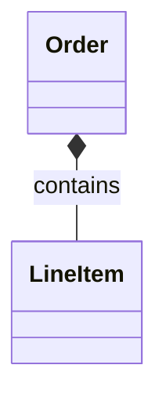
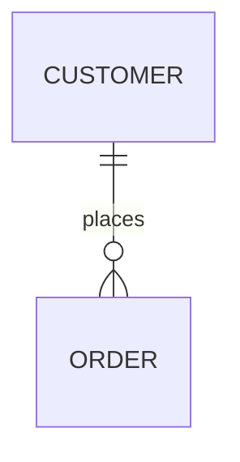
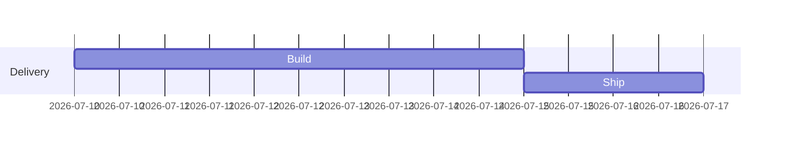

# Nereid MCP Playbooks

Use these payloads with the `nereid` skill. Keep calls small and local first.
Treat session files (`nereid-session.meta.json`, `diagrams/*.mmd`, `walkthroughs/*.wt.json`) as app-managed state snapshots that may be rewritten frequently.
Use MCP/TUI tools so session metadata and revision history stay coherent.

## Startup and target resolution

```bash
# TUI + MCP HTTP
cargo run -- --session path/to/session

# stdio MCP
cargo run -- --mcp --session path/to/session
```

Resolve active diagram:
1. `diagram_current`
2. if null: `diagram_list`
3. then: `diagram_open`

Resolve active walkthrough with the same pattern:
1. `walkthrough_current`
2. if null: `walkthrough_list`
3. then: `walkthrough_open`

If you need a new diagram first, call `diagram_create_from_mermaid`:

```json
{
  "mermaid": "flowchart TD\n  A --> B",
  "diagram_id": "d-my-flow",
  "name": "My Flow",
  "make_active": true
}
```

Creation runs parse + render preflight. If the call returns `INVALID_PARAMS` with
`cannot render Mermaid diagram: ...` (for example cycle/layout issues), fix Mermaid and retry
before proceeding.
For create/switch-only tasks, use the create response as the success signal; skip
`diagram_stat`/`diagram_render_text`/`flow_*` unless inspection is explicitly requested.
Failed preflight is non-mutating: no new diagram is persisted and active diagram remains unchanged.

The same creation tool accepts all five supported Mermaid headers:

```text
sequenceDiagram
flowchart TD
classDiagram
erDiagram
gantt
```

For example:







Delete a diagram when cleaning up:

```json
{
  "diagram_id": "d-my-flow"
}
```

## Live collaboration state

### Read human attention

Tool: `attention_human_read`

```json
{}
```

### Set and read agent attention

Tool: `attention_agent_set`

```json
{
  "object_ref": "d:d-auth-flow/flow/node/n:authorize"
}
```

Tool: `attention_agent_read`

```json
{}
```

### Clear agent attention

Tool: `attention_agent_clear`

```json
{}
```

### Follow-AI mode

Tool: `follow_ai_read`

```json
{}
```

Tool: `follow_ai_set`

```json
{
  "enabled": true
}
```

### Shared working set

Tool: `selection_update`

```json
{
  "object_refs": [
    "d:d-auth-flow/flow/node/n:start",
    "d:d-auth-flow/flow/node/n:authorize"
  ],
  "mode": "replace"
}
```

## Probe before edit

Tool: `diagram_stat`

```json
{
  "diagram_id": "d-auth-flow"
}
```

Tool: `diagram_get_slice`

```json
{
  "diagram_id": "d-auth-flow",
  "center_ref": "d:d-auth-flow/flow/node/n:start",
  "radius": 2
}
```

Canonical object ref format:
`d:<diagram_id>/<category...>/<object_id>`

Supported category pairs:

- Sequence: `seq/participant`, `seq/message`, `seq/block`, `seq/section`
- Flowchart: `flow/node`, `flow/edge`
- Class: `class/class`, `class/relation`
- ER: `er/entity`, `er/relationship`
- Gantt: `gantt/section`, `gantt/task`, `gantt/lane`

Examples:

```text
d:d-model/class/class/c:Order
d:d-model/class/relation/r:0001
d:d-data/er/entity/e:CUSTOMER
d:d-data/er/relationship/r:0001
d:d-plan/gantt/section/sec:0001
d:d-plan/gantt/task/t:0001
d:d-plan/gantt/lane/lane:2026-01-01
```

## Read and mutation boundaries by kind

- All five kinds support create, list/open, raw Mermaid read, text render, replace, xrefs,
  selection, attention, and route participation.
- `diagram_get_ast` and `object_read` expose kind-specific class, ER, and Gantt fields, including
  class members, typed ER cardinalities, and Gantt sections, starts, durations, and dependencies.
- Sequence and flowchart have structured mutation ops and dedicated typed query helpers.
- Class, ER, and Gantt are edited through `diagram_replace_from_mermaid` (or the TUI editor).
- Gantt lane refs are rendered time-header anchors. Valid `YYYY-MM-DD` schedules use stable
  calendar ids such as `lane:2026-01-01`; schedules without parseable absolute dates use relative
  ids such as `lane:0000`. Prefer `gantt/task` or `gantt/section` as a `diagram_get_slice` center.

## Safe mutation pattern

1. `diagram_propose_ops`
2. if result is good: same payload to `diagram_apply_ops`

```json
{
  "diagram_id": "d-auth-flow",
  "base_rev": 3,
  "ops": [
    {
      "type": "flow_add_node",
      "node_id": "n:authorize",
      "label": "Authorize",
      "shape": "rect"
    },
    {
      "type": "flow_add_edge",
      "edge_id": "e:authorize",
      "from_node_id": "n:start",
      "to_node_id": "n:authorize",
      "label": "token ok"
    }
  ]
}
```

## Sequence insertion

```json
{
  "diagram_id": "d-checkout-seq",
  "base_rev": 7,
  "ops": [
    {
      "type": "seq_add_participant",
      "participant_id": "p:fraud",
      "mermaid_name": "FraudService"
    },
    {
      "type": "seq_add_message",
      "message_id": "m:fraud-check",
      "from_participant_id": "p:api",
      "to_participant_id": "p:fraud",
      "kind": "sync",
      "text": "validate(payment)",
      "order_key": 35
    }
  ]
}
```

## Sequence structure (alt/else)

Batch structure + membership in one apply so empty sections never become the committed state.
Messages in each section must be contiguous by `order_key`.

```json
{
  "diagram_id": "d-checkout-seq",
  "base_rev": 8,
  "ops": [
    {
      "type": "seq_add_block",
      "block_id": "b:cache",
      "kind": "alt",
      "header": "cache",
      "main_section_id": "sec:cache:main"
    },
    {
      "type": "seq_add_section",
      "section_id": "sec:cache:else",
      "block_id": "b:cache",
      "kind": "else",
      "header": "miss"
    },
    {
      "type": "seq_add_message",
      "message_id": "m:hit",
      "from_participant_id": "p:api",
      "to_participant_id": "p:cache",
      "kind": "sync",
      "text": "hit",
      "order_key": 40,
      "section_id": "sec:cache:main"
    },
    {
      "type": "seq_add_message",
      "message_id": "m:miss",
      "from_participant_id": "p:api",
      "to_participant_id": "p:db",
      "kind": "sync",
      "text": "miss",
      "order_key": 50,
      "section_id": "sec:cache:else"
    }
  ]
}
```

Move an existing free message into a section:

```json
{
  "type": "seq_set_message_section",
  "message_id": "m:fraud-check",
  "section_id": "sec:cache:main"
}
```

## Bulk replace from Mermaid

Prefer structure ops for local edits. Use replace when rewriting whole Mermaid source while keeping stable ids when fingerprints match:

```json
{
  "diagram_id": "d-checkout-seq",
  "base_rev": 9,
  "mermaid": "sequenceDiagram\n  participant api\n  participant fraud\n  api->>fraud: validate(payment)\n"
}
```

Inspect `identity.preserved`, `identity.dropped`, `identity.newly_allocated`, and `dangling_xref_ids` in the response.

## Cross-diagram mapping and routes

Tool: `xref_add`

```json
{
  "xref_id": "x:authorize-impl",
  "from": "d:d-auth-flow/flow/node/n:authorize",
  "to": "d:d-checkout-seq/seq/message/m:fraud-check",
  "kind": "implements",
  "label": "authorization path"
}
```

Tool: `xref_list` (dangling TODOs)

```json
{
  "dangling_only": true
}
```

Tool: `route_find`

```json
{
  "from_ref": "d:d-auth-flow/flow/node/n:start",
  "to_ref": "d:d-checkout-seq/seq/message/m:fraud-check",
  "limit": 3,
  "max_hops": 12,
  "ordering": "fewest_hops"
}
```

## Walkthrough refinement

Tool: `walkthrough_apply_ops`

```json
{
  "walkthrough_id": "wt:auth-overview",
  "base_rev": 2,
  "ops": [
    {
      "type": "add_node",
      "node_id": "wn:entry",
      "title": "Entry path",
      "body_md": "Request enters API and reaches auth gate.",
      "refs": [
        "d:d-auth-flow/flow/node/n:start"
      ],
      "tags": [
        "overview"
      ],
      "status": "ok"
    },
    {
      "type": "add_edge",
      "from_node_id": "wn:entry",
      "to_node_id": "wn:authorize",
      "kind": "next",
      "label": "auth step"
    }
  ]
}
```

## Conflict handling

On stale `base_rev`:
1. refresh with `diagram_diff` or `walkthrough_diff`,
2. rebase ops,
3. retry apply.

If diff history is unavailable, fetch `diagram_read` or `walkthrough_read` once, then return to diff/slice-first calls.
